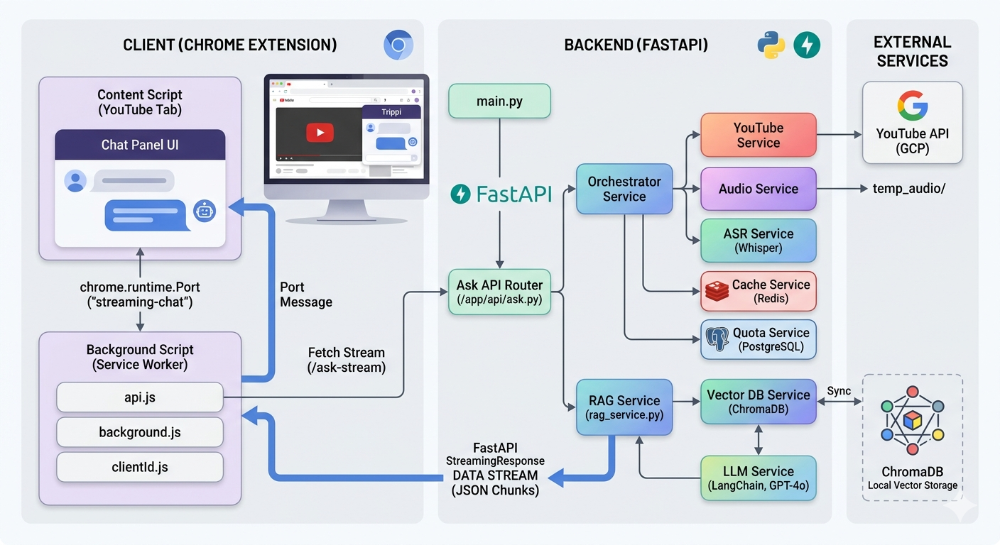

# Trippi: Agentic YouTube AI Assistant 🤖🎥

Trippi is a high-performance, RAG-based (Retrieval-Augmented Generation) Chrome Extension designed to transform how users interact with video content. By leveraging FastAPI, LangChain, and ChromaDB, it provides real-time, streaming AI responses based on video transcripts and user comments.

---

## 🏗️ System Architecture



*The diagram above illustrates the multi-process communication between the Chrome Content Script, Background Service Worker, and the FastAPI RAG Pipeline.*

---

## 🚀 Key Features

* **Real-time Streaming:** Token-by-token response delivery using FastAPI `StreamingResponse` and Chrome `runtime.Port`.
* **Robust RAG Pipeline:** Context-aware answering using **LangChain** and **ChromaDB** vector storage.
* **Intelligent Fallback:** Automatically switches to **OpenAI Whisper ASR** if native YouTube transcripts are unavailable or disabled.
* **Scalable Backend:** Built with **FastAPI** for high concurrency and asynchronous processing.
* **Client Management:** Persistent `client_id` tracking via `chrome.storage` for quota and session management.

---

## 🛠️ Tech Stack

- **Frontend:** JavaScript (ES6+), Chrome Extension API (Manifest V3)
- **Backend:** Python 3.10+, FastAPI, Uvicorn
- **AI/ML:** LangChain, OpenAI GPT-4o, OpenAI Embeddings, Whisper ASR
- **Database:** ChromaDB (Vector Store)
- **DevOps:** Git, `.env` configuration

---

## ⚙️ Installation & Setup

### 1. Backend Setup
```bash
cd backend
python -m venv venv
source venv/bin/activate  # On Windows: venv\Scripts\activate
pip install -r requirements.txt
# Create a .env file with your OPENAI_API_KEY
uvicorn main:app --reload